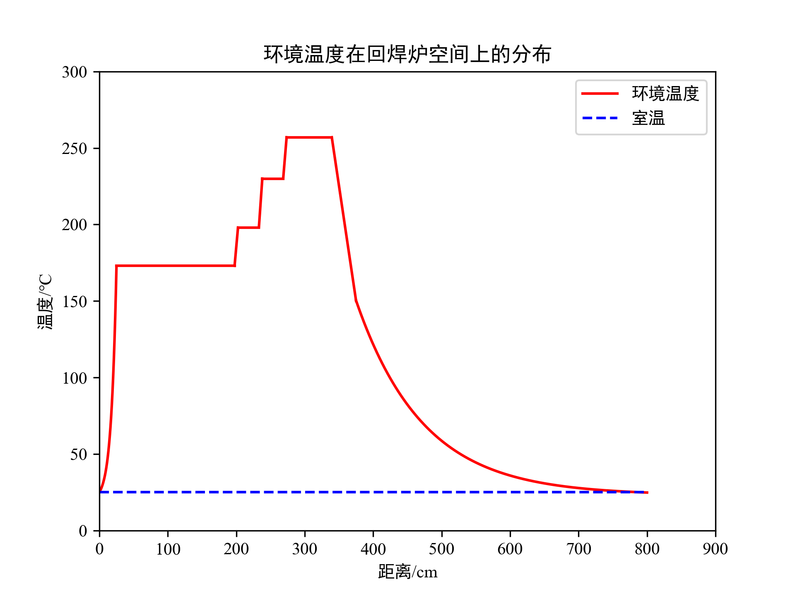

- 相关资料（含题目与优秀论文）  
（2020A-炉温曲线.docx、A070.pdf、result.csv、附件.xlsx）  

[Download](https://github.com/XuebaStudy/notebook_assets/raw/refs/heads/main/MCM2020_A070.zip){.md-button}

??? code "得到论文中 图4"
    ```python
    SQ1 = 2000; SQ2 = 200   # Sampling quantity

    T0 = 25; T1 = 173       # Temperature
    T2 = 198; T3 = 230
    T4 = 257; T5 = 150

    # 距开始处的 Distance
    D0 = 0
    # 炉前
    D1 = 25
    # 小温区1~5
    D2 = 197.5
    # 小温区5与6之间
    D3 = 202.5
    # 小温区6
    D4 = 233
    # 小温区6与7之间
    D5 = 238
    # 小温区7
    D6 = 268.5
    # 小温区7与8之间
    D7 = 273.5
    # 小温区8~9
    D8 = 339.5
    # 小温区9与10之间 & 小温区10
    D9 = 375
    # 小温区10后
    D10 = 800
    # 冷却至室温

    SD = 78     # Speed (cm/min)

    import matplotlib.pyplot as plt
    import numpy as np
    from scipy.optimize import curve_fit
    from matplotlib import rcParams
    import warnings

    config = {
            "font.family": ["Times New Roman","SimHei"],
            "mathtext.fontset": 'stix',  # matplotlib渲染数学字体时使用的字体，和Times New Roman差别不大
            "font.serif": ['Times New Roman','SimHei'],  # 黑体
            'axes.unicode_minus': False  # 处理负号，即-号
        }
    rcParams.update(config)

    def F1(x,a,b,c):
        return a*np.exp(b*x)+c
    def L56(x):
        return (T2-T1)/(D3-D2)*(x-D2)+T1
    def L67(x):
        return (T3-T2)/(D5-D4)*(x-D4)+T2
    def L78(x):
        return (T4-T3)/(D7-D6)*(x-D6)+T3
    def L10(x):
        return (T5-T4)/(D9-D8)*(x-D8)+T4
    def F2(x,a,b,c,x0):
        return a*np.exp(-b*(x-x0))+c

    x1 = [D0,20,D1]
    y1 = [T0,99,T1]
    pars1,_= curve_fit(F1,x1,y1,maxfev=10000)
    x2 = [D9,425,525,D10]
    y2 = [T5,100,50,T0]
    guess2 = [1,0.01,25,D9+200]
    pars2,_= curve_fit(F2,x2,y2,p0=guess2,maxfev=10000)

    X1 = np.linspace(D0,D1,SQ1)
    Y1 = F1(X1,*pars1)
    X2 = np.linspace(D1,D2,SQ2)
    Y2 = [T1]*SQ2
    X3 = np.linspace(D2,D3,SQ2)
    Y3 = L56(X3)
    X4 = np.linspace(D3,D4,SQ2)
    Y4 = [T2]*SQ2
    X5 = np.linspace(D4,D5,SQ2)
    Y5 = L67(X5)
    X6 = np.linspace(D5,D6,SQ2)
    Y6 = [T3]*SQ2
    X7 = np.linspace(D6,D7,SQ2)
    Y7 = L78(X7)
    X8 = np.linspace(D7,D8,SQ2)
    Y8 = [T4]*SQ2
    X9 = np.linspace(D8,D9,SQ2)
    Y9 = L10(X9)
    X10 = np.linspace(D9,D10,SQ1)
    Y10 = F2(X10,*pars2)

    Xs = [X1,X2,X3,X4,X5,X6,X7,X8,X9,X10]
    Ys = [Y1,Y2,Y3,Y4,Y5,Y6,Y7,Y8,Y9,Y10]
    # plt.figure(figsize=(4,10))

    for i, (X, Y) in enumerate(zip(Xs, Ys)):
        if i == 0:
            plt.plot(X, Y, color='r', label='环境温度')
        else:
            plt.plot(X, Y, color='r')

    plt.plot([i for i in np.linspace(0,800,200)],[25]*200,color='b',ls='--',label='室温')
    plt.legend()
    plt.xlabel('距离/cm')
    plt.ylabel('温度/℃')
    plt.title('环境温度在回焊炉空间上的分布')
    plt.axis([0,900,0,300])
    plt.show()
    ```
    效果图：
    

