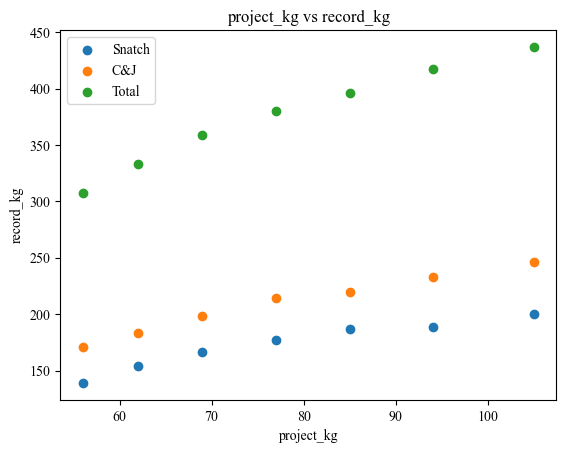

```python
# from selenium import webdriver
# from selenium.webdriver.common.by import By
# from selenium.webdriver.chrome.service import Service
# from selenium.webdriver.chrome.options import Options
# import time
# from bs4 import BeautifulSoup
# import plotly.graph_objects as go

# 优先使用request
import requests
import re
import pandas as pd
import matplotlib.pyplot as plt

from matplotlib import rcParams
config = {
        "font.family": ["Times New Roman","SimHei"],
        "mathtext.fontset": 'stix',  # matplotlib渲染数学字体时使用的字体，和Times New Roman差别不大
        "font.serif": ['Times New Roman','SimHei'],  # 黑体
        'axes.unicode_minus': False  # 处理负号，即-号
    }
rcParams.update(config)

# exe_path = r"C:\Program Files\Google\Chrome\Application\chromedriver.exe"
# # 设置Selenium WebDriver
# options = Options()
# options.add_argument("--headless")  # 无头模式，不显示浏览器界面
# service = Service(executable_path=exe_path)  # 替换为你的chromedriver路径
# driver = webdriver.Chrome(service=service, options=options)

# # 查看默认的 User-Agent
# response = requests.get('http://httpbin.org/get')
# print("默认的 User-Agent:", response.json()['headers']['User-Agent'])
# # 设置自定义的 User-Agent
# headers = {
#     'User-Agent': 'MyCustomUserAgent/1.0'
# }
# response = requests.get('http://httpbin.org/get', headers=headers)
# print("自定义的 User-Agent:", response.json()['headers']['User-Agent'])

# 打开目标网页
url = "https://iwf.sport/results/world-records/world-records-old-bw/?ranking_curprog=current&ranking_agegroup=Senior&ranking_gender=m"

# driver.get(url)
# time.sleep(5)
# html_content = driver.page_source
# driver.quit()

req = requests.get(url)
if req.status_code != 200:
    print("请求失败")
    exit()
else:
    html_content = req.text

# print(html_content)

re_kg = re.compile(r'<h2>([\d].*?)</h2>')
kg_list = re_kg.findall(html_content)
kg_list = [kg for kg in kg_list for i in range(3)]

detail_str = (r'<p>\s*(.*?)\s*</p>.*?'
            r'Record: </span>\s*(.*?)\s*</p>.*?'
            r'<strong>(.*?)</strong>.*?'
            r'Born: </span>\s*(.*?)\s*</p>.*?'
            r'</span>\s*(.*?)\s*</p>.*?'
            r'<strong>\s*(.*?)\s*</strong>.*?')
re_detail = re.compile(detail_str,re.S)
detail_list = re_detail.findall(html_content)

data = [(x, *y) for x, y in zip(kg_list,detail_list )]

df = pd.DataFrame(data,
columns=['project_kg','project_how', 'record_kg','name', 'born','country', 'date&place'])

print(df.head())
``` 
??? info "Output"
    ```title=''
        project_kg project_how record_kg           name          born country  \
    0      56 kg      Snatch    139 kg    WU Jingbiao  Oct 01, 1989     CHN   
    1      56 kg         C&J    171 kg    OM Yun Chol  Nov 18, 1991     PRK   
    2      56 kg       Total    307 kg  LONG Qingquan  Dec 03, 1990     CHN   
    3      62 kg      Snatch    154 kg     KIM Un Guk  Oct 28, 1988     PRK   
    4      62 kg         C&J    183 kg     CHEN Lijun  Feb 08, 1993     CHN   

                            date&place  
    0         Nov 21, 2015 - Houston  
    1         Nov 21, 2015 - Houston  
    2  Aug 07, 2016 - Rio de Janeiro  
    3         Sep 21, 2014 - Incheon  
    4         Nov 22, 2015 - Houston  
    ```


```python
# 提取 'project_kg' 列中的数字部分并转换为整数 方法一
df['project_kg'] = df['project_kg'].apply(lambda x: int(x[:-3]))
df['record_kg'] = df['record_kg'].apply(lambda x: int(x[:-3]))

# 提取 'project_kg' 列中的数字部分并转换为整数 方法二
# df['project_kg'] = df['project_kg'].str.extract(r'(\d+)').astype(int)

# 过滤、组合不同条件数据（index 不变）
df_snatch = df[df['project_how'].isin(['Snatch'])]
df_cj = df[df['project_how'].isin(['C&J'])]
df_total = df[df['project_how'].isin(['Total'])]
print(df_snatch)
```

??? info "Output"
    ```title=''
        project_kg project_how  record_kg            name          born country  \
    0           56      Snatch        139     WU Jingbiao  Oct 01, 1989     CHN   
    3           62      Snatch        154      KIM Un Guk  Oct 28, 1988     PRK   
    6           69      Snatch        166        LIAO Hui  Oct 05, 1987     CHN   
    9           77      Snatch        177     LYU Xiaojun  Jul 27, 1984     CHN   
    12          85      Snatch        187  RYBAKOU Andrei  Mar 04, 1982     BLR   
    15          94      Snatch        189   MORADI Sohrab  Sep 22, 1988     IRI   
    18         105      Snatch        200  ARAMNAU Andrei  Apr 17, 1988     BLR   

                            date&place  
    0          Nov 21, 2015 - Houston  
    3          Sep 21, 2014 - Incheon  
    6           Nov 10, 2014 - Almaty  
    9   Aug 10, 2016 - Rio de Janeiro  
    12       Sep 22, 2007 - ChiangMai  
    15         Aug 25, 2018 - Jakarta  
    18         Aug 18, 2008 - Beijing  
    ```


```python
plt.scatter(df_snatch['project_kg'], df_snatch['record_kg'],label='Snatch')
plt.scatter(df_cj['project_kg'], df_cj['record_kg'],label='C&J')
plt.scatter(df_total['project_kg'], df_total['record_kg'],label='Total')
plt.xlabel('project_kg')
plt.ylabel('record_kg')
plt.title('project_kg vs record_kg')
plt.legend()
plt.show()

# 保存原始数据
# df.to_csv('data.csv', index=False)

# 命令行使用 jupyter nbconvert --to markdown "xxx.ipynb"将 ipynb 文件转换为 markdown
```

!!! info "Output"
    
    

