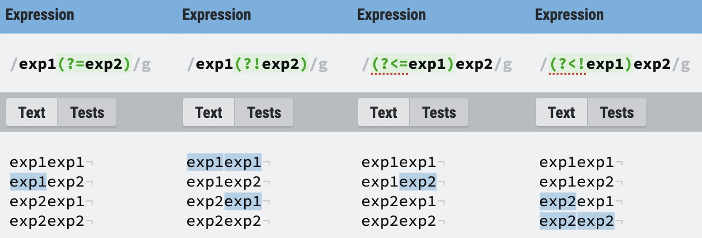

# 正则表达式
> 本文转载、加工自一位我非常尊敬的学长——[TonyCrane](https://note.tonycrane.cc/cs/regex/)

> 正则表达式（Regular Expression）使用单个字符串来描述、匹配一系列匹配某个句法规则的字符串。
> <div style="text-align: right">———— 维基百科</div>

!!! abstract
    正则表达式用途广泛，而且功能强大又好用。可以说既简单又繁琐，但是用起来很爽

    一些工具：

    - [RegExr 正则在线测试工具](https://regexr.com/)
    - [Regulex 正则表达式可视化](https://jex.im/regulex/)
    - [HackerRank regex 习题集](https://www.hackerrank.com/domains/regex)

## 1 语法
### 1.1 普通字符
所有不是元字符的字符都可以直接写出来用来匹配，比如大小写字母、数字、符号等

有语法意义的字符需要使用 `\` 转义，比如 `\( \) \[ \] \. `分别匹配 ()[]. 这五个字符

|语法|描述|
|:--|:--|
|[...]|匹配任意在 `...` 中的字符，如 [ABC] 匹配所有 A B C 字符|
|[^...]|匹配任意不在 `...` 中的字符，如 [^ABC] 匹配除了 A B C 外的所有单个字符|
|[x-y]|按照顺序匹配从 `x` 到 `y` 到所有字符，如 [a-z] 匹配所有小写字母，[A-E] 匹配 A 到 E 这五个字符|
|.|匹配任意除了换行符以外的字符|
|\w|匹配字母数字下划线，相当于 [a-zA-Z0-9_]|
|\d|匹配数字，相当于 [0-9]|
|[\u4e00-\u9fa5]|匹配所有Unicode编码的汉字|
|x\|y|匹配 `x` 或 `y`，优先级最低，如 `a|bcd` 匹配 a 或 bcd|

### 1.2 非打印字符
|语法|描述|
|:--|:--|
|\cx|匹配由 x 指明的控制字符，x 必须属于 [a-zA-Z]，否则 \c 直接视为 c，如 \cM 匹配 Ctrl-M 即回车符|
|\f|匹配一个换页符，相当于 \x0c \cL|
|\n|匹配一个换行符，相当于 \x0a \cJ|
|\r|匹配一个回车符，相当于 \x0d \cM|
|\t|匹配一个制表符，相当于 \x09 \cI|
|\v|匹配一个垂直制表符，相当于 \x0b \cK|
|\s|匹配任何空白字符，相当于 [ \f\n\r\t\v] （注意首位有个空格），unicode 下也会匹配全角空格符|
|\S|匹配任何非空白符，相当于 [^ \f\n\r\t\v]|

### 1.3 限定符
用来指定一个子表达式出现了多少次

|语法|描述|
|:--|:--|
|\{n\}|前一个子表达式匹配准确的 n 次，如 o\{2\} 匹配两个连续的 o|
|\{n,\}|前一个子表达式匹配至少 n 次，如 o\{2,\} 可以匹配 goooood 中的所有 o，但不匹配 god 中的 o|
|\{n,m\}|前一个子表达式匹配至少 n 次，至多 m 次|
|*|前一个子表达式匹配 0 次或多次，相当于 \{0,\}|
|+|前一个子表达式匹配 1 次或多次，相当于 \{1,\}|
|?|前一个子表达式可有可无（匹配 0 次或 1 次），相当于 \{0,1\}|

#### 贪婪
\* 和 + 的匹配都是贪婪的，即尽可能匹配更多的字符，而在它们后面加上 ? 就可以非贪婪（即最小匹配）

- <.*> 会匹配整个 `<h1>header</h1>` 字符串
- <.*?> 只会匹配其中的 `<h1>` 和 `</h1>`

### 1.4 定位符
只匹配位置，没有字符与之对应

|语法|描述|
|:--|:--|
|^|匹配字符串开头，如果是多行模式，则新的一行也算新的字符串|
|$|匹配字符串结尾，多行模式同理看成多个字符串|
|\b|匹配单词边界，即字符与空格中间的位置|
|\B|匹配非单词边界|

定位符只能单独使用，不能附加限制符指定个数

### 1.5 分组
用 () 可以指定匹配一个组，使用 () 可以指定不同选项，每一项间用 | 分隔

同时 () 也是捕获分组，即括号内匹配的内容会被缓存，如果要避免这种，需要使用 (?:) 非捕获元来进行匹配

#### 1.5.1 反向引用
被缓存的捕获分组可以直接使用 \n 再次引用，其中 n 是 1 到 2 位的十进制数<br/>
捕获分组的编号从 1 开始，最多 99 个，\1 即表示和第一个圆括号中匹配的结果相同的部分

如 (abc|def)\1 匹配 abcabc、defdef 但不匹配 abcdef、defabc

#### 1.5.2 先行断言和后行断言
正则表达式有先行断言（lookahead）和后行断言（lookbehind），分为四种形式：

|语法|名称|
|:--:|:--:|
|(?=pattern)|零宽正向先行断言<br/>zero-width positive lookahead assertion|
|(?!pattern)|零宽负向先行断言<br/>zero-width negative lookahead assertion|
|<div style="font-variant-ligatures: none;">(?<=pattern)</div>|零宽正向后行断言<br/>zero-width positive lookbehind assertion|
|(?<!pattern)|零宽负向后行断言<br/>zero-width negative lookbehind assertion|

和定位符类似，它只匹配位置，不匹配内容，所以叫做零宽（zero-width），这些位置的规则是：

- (?=pattern)：匹配后面可以匹配 pattern 的位置
- (?!pattern)：匹配后面无法匹配 pattern 的位置
- <span style="font-variant-ligatures: none;">(?<=pattern)</span>：匹配前面可以匹配 pattern 的位置
- (?<!pattern)：匹配前面无法匹配 pattern 的位置

???+ example "例子"
    

其中后行断言有些语言不支持（python re 支持）

## 2 修饰符
修饰符不属于表达式的内容，但是指定了匹配的规则，js 中的正则写法为 /pattern/flags<br/>
其中 flags 就是修饰符

|修饰符|名称|含义|
|:--|:--|:--|
|i|ignore|忽略大小写|
|g|global|全局匹配，查找所有匹配项|
|m|multi-line|多行匹配，使 ^$ 匹配每行的开头和结尾|
|s|single-line|单行匹配，只视为一个字符串，. 也可以匹配换行符|

不同语言中写法和种类不同

## 3 优先级
正则表达式也有优先级，同一优先级则从左向右运算，不同优先级则从高到低。从高到低：

- 转义符 `\`
- 括号符 `(...) (?:...) (?=...) (?!...) (?<=...) (?<!...) [...] [^...]`
- 限定符 `* + ? {n} {n,} {n,m}`
- 定位符 `^ $`
- 字符
- 或 `|`

## 4 Python re 模块
python 的 re 模块提供了正则表达式的相关方法：

- re.match(pattern, string, flags=0)：使用 pattern **从头**匹配 string，flags 为修饰符。<br/>匹配失败返回 None，匹配成功返回一个 re.Match
- re.search(pattern, string, flags=0)：使用 pattern 扫描整个 string，返回第一个匹配的 re.Match
- re.sub(pattern, repl, string, count=0, flags=0)：
    - pattern：要被替换部分的正则表达式
    - repl：替换的字符串，或者替换用的函数
        - 是函数时接受一个 re.Match，返回一个字符串
    - string：原字符串
    - count：替换的最大次数，是 0 时表示替换全部
    - flags：修饰符
- re.findall(pattern, string, flags=0)：在 string 中查找所有匹配 pattern 的结果，返回列表
- re.finditer(pattern, string, flags=0)：在 string 中查找所有匹配 pattern 的部分，返回迭代器
- re.split(pattern, string, maxsplit=0, flags=0)：
    - pattern：要保留部分的正则表达式
    - string：原字符串
    - maxsplit：分隔次数，是 0 是全部分隔
    - flags：修饰符
    - 返回一个分割后的列表
- re.escape(pattern)：转义 pattern 中的特殊字符

### 4.1 re.Pattern
用法类似直接使用 re，只是进行了预编译，并且固定了 pattern 和 flags
- re.compile(pattern, flags=0)：编译一个正则表达式，返回一个 re.Pattern
- Pattern.search(string[, pos[, endpos]])
- Pattern.match(string[, pos[, endpos]])
- Pattern.fullmatch(string[, pos[, endpos]])
- Pattern.split(string, maxsplit=0)
- Pattern.findall(string[, pos[, endpos]])
- Pattern.finditer(string[, pos[, endpos]])
- Pattern.sub(repl, string, count=0)
- Pattern.pattern：正则表达式
- Pattern.flags：修饰符
- Pattern.groups：int 值，pattern 中捕获组的个数
- Pattern.groupindex：一个字典，如果 pattern 中包含 (?P<name\>...) 则包含一个从 name 映射到捕获组编号的键值对

### 4.2 re.Match
re.Match 是 match 和 search 在成功匹配时返回的类型

- Match.group([group])：返回字符串
    - group() 或 group(0) 返回匹配的完整字符串
    - group(i) 返回第 i 个捕获组
- Match.start([group])：Match.group([group]) 在整个原字符串中的起始位置（子串第一个字符的索引）
- Match.end([group])：Match.group([group]) 在整个原字符串中的结束位置（子串最后一个字符索引+1）
- Match.span([group])：返回 (Match.start([group]), Match.end([group]))
- Match.\_\_gettiem\_\_([group])：等同于 .group([group])

### 4.3 额外语法
- (?#...)：注释，直接忽略
- (?P<name>...)：为捕获组命名为 name（必须是合法 python 变量名，并且同一个 pattern 中不能重复），后面可以通过 name 引用，也可以通过编号引用。在 Match.group([group]) 的 group 中可以直接使用 "name" 来获取这个捕获组
- (?P=name)：与名字为 name 的捕获组完全相同的部分，相当于通过编号引用
- (?(id/name)yes-pattern|no-pattern)：如果编号为 id 或者名字为 name 的捕获组存在，则此处使用 yes-pattern，否则使用 no-pattern
    - 例如：`(<)?(\w+@\w+(?:\.\w+)+)(?(1)>|$)` 匹配 `'<user@host.com>'` 和 `'user@host.com'`，但不匹配 `'<user@host.com'` 和 `'user@host.com>'`

### 4.4 标识符
|标识符|含义|
|:--:|:--|
|re.I|忽略大小写|
|re.M|多行匹配，使 ^ 和 $ 匹配每一行的开始和结束，而不仅仅是整个字符串的开始和结束。|
|re.S|使 . 匹配任何字符，包括换行符|
|re.U|使用 unicode，影响 \w\W\b\B|
|re.X|使用 python 一样的注释，忽略空格和注释，并且有多行 pattern 的优化，可以更清晰地组织复杂的正则表达式|

同时使用多个标识符，用 | 隔开（如 re.I | re.M 表示多行且忽略大小写）

???+ example "re.X 的例子"
    ```python
    a = re.compile(r"""\d +  # the integral part
                       \.    # the decimal point
                       \d *  # some fractional digits""", re.X)
    b = re.compile(r"\d+\.\d*")
    ```
    a b 等价