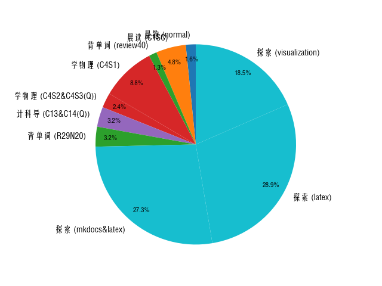

## 2024.8.15:
!!! info annotate "Things have done"
    晨跑/normal/10min
    晨读/C1SC/30min
    背单词/review40/8min
    学物理/C4S1/55min
    学物理/C4S2&C4S3(Q)/15min
    计科导/C13&C14(Q)/20min
    背单词/R29N20/20min
    探索/mkdocs&latex/170min
    探索/latex/180min
    探索/visualization/115min 

    Pie Chart:(1)
1.  

??? note "Introspection"
    今天大部分时间花在了“探索”上，肝到了凌晨，难以自拔。还是应该多花时间在打学业基础上，以后要尽量做到“荤素搭配”。时间的管控也需要加强（凌晨休息还是不可持续的）==

## 2024.8.16:
!!! info "Things have done"
    晨跑/normal/10min
    探索/?/?min
    运动/normal/20min
    探索/?/?min

??? note "Introsperction"
    我失败了==,时间主要花在探索html与Latex公式颜色上，明天，加油改进...

## 2024.8.17:
!!! info "Things have done"
    晨跑/normal/10min
    晨读/C2SA/15min
    背单词/R40/8min
    学物理/C4S4/15min
    探索/?/?min

??? note "Introsperction"
    emm...无需多言，探索了音频处理、html、markdown元素插入(如 https://xuebastudy.github.io/notebook/Music/Others/mp3_visualization/)，网站源代码与结构，路径使用...虽然探索暂时难以遏制，但明天开始要仔细记录一下，把无意间流失的时间用到学业上...毕竟干得好，才像个 "believer" ...哎呀呀,毕竟伊蕾娜小姐实在太可爱啦!😊...

## 2024.8.18:
!!! info "Things have done"
    晨跑/normal/10min
    晨读/C2SB/30min
    探索/C盘空间&软件删除/120min
    整理/电脑文件/180min
    整理/微信文件/20min
    小提琴/task&free/60min
    整理/微信文件/30min

??? note "Introsperction"
    如上，我的评价是应该把非学业事务放入“规定好时间的休息”，否则容易上头，分不清主次关系...伊蕾娜小姐，您愿意给我一次改进的机会吗😭...

## 2024.8.19:
??? note "Introsperction"
    emo了...一不小心看了Re0的第一季和部分第二季(早有耳闻，但没被剧透)。好久没有过“心颤”(物理意义上)的感觉了，不得不说，Re0对氛围的一步步渲染实在太...某些场景下的绝望感与无助感...虽然确实有数次一败涂地后抓住希望突破的剧情，但还是接连不断地处于紧张事件中，虽然发糖也有(雪中送碳式，更加珍贵)，但一想到之后的“刀”剧情，又难以下咽了。看过后也不自觉地思考过很久，感觉确实是神作，**悲剧确实有洗涤人心的力量，但有点让我喘不过气来。**  
    Re0目前我不忍再看，还是让一些温情、欢快(哪怕深度一般)的番来治愈偶尔疲惫的我吧。但总而言之，Re0已经在我心中留下了“惊鸿一瞥”，影响很大...

## 2024.8.20:
!!! info "Things have done"
    背单词/R60/12min
    学物理/C5S3&4&5/45min
    学物理/C5S6/20min
    汇编语言/C11-17(L1)/15min
    计科导/C15/15min
    菜鸟教程/正则表达式1/30min
    菜鸟教程/正则表达式2/20min

??? note "Introsperction"
    很有趣哟~...出去做客的时候在空闲时间争分夺秒，不自觉地学起了新知识（正则表达式），在家里反而效率低下，甚至一事无成。真是奇怪的人性捏（苦笑...这种事不像心情低落，可以寄托内心给信仰。怎么办捏...
