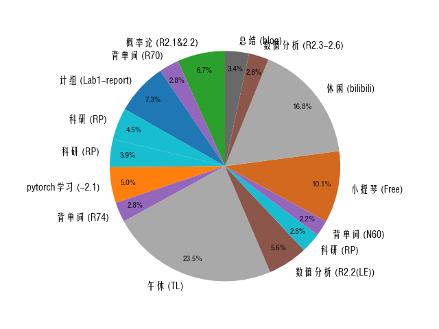
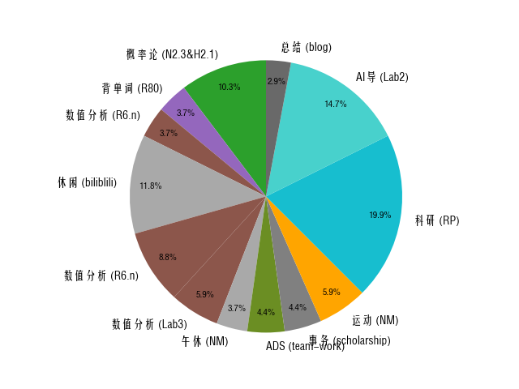
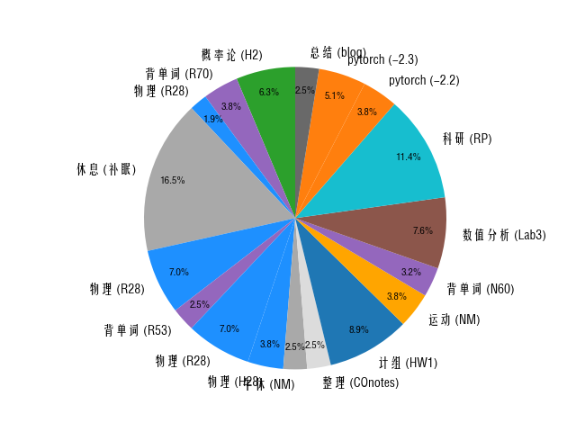

## 2024.10.1:
!!! info annotate "Things have done"
    概率论/R2.1&2.2/60min
    背单词/R70/25min
    计组/Lab1-report/65min
    科研/RP/40min
    科研/RP/35min
    pytorch学习/-2.1/45min
    背单词/R74/25min
    午休/TL/210min
    数值分析/R2.2(LE)/50min
    科研/RP/25min
    背单词/N60/20min
    小提琴/Free/90min
    休闲/bilibili/150min
    数值分析/R2.3-2.6/25min
    总结/maybe/15min

    Pie Chart:(1)
1.  

??? note "Introspection"
    今天像是做了一些事，但感觉效率有待加强，要更多花时间在学业上，减少“时间耗散”。~~如果每天都能达到期末周的效率就好了~~

## 2024.10.2:
!!! info annotate "Things have done"
    概率论/N2.3&H2.1/70min
    背单词/R80/25min
    数值分析/R6.n/25min
    休闲/biliblili/80min
    数值分析/R6.n/60min
    数值分析/Lab3/40min
    午休/NM/25min
    ADS/team-work/30min
    事务/scholarship/30min
    运动/NM/40min
    科研/RP/135min
    AI导/Lab2/100min

    Pie Chart:(1)
1.  

??? note "Introspection"
    ......还是效率没到达“期末周”水平，而且这样一回顾，感觉一天也没干什么，也许这就是记录时间的魅力吧
    ~~（帮助我们认识到自己什么也没干）~~ 不敢奢望明天，但我会努力的。信仰正注视着我呢！我不能辜负！

## 2024.10.3:
!!! info annotate "Things have done"
    概率论/H2/50min
    背单词/R70/30min
    物理/R28/15min
    休息/补眠/130min
    物理/R28/55min
    背单词/R53/20min
    物理/R28/55min
    物理/H28/30min
    午休/NM/20min
    整理/COnotes/20min
    计组/HW1/70min
    运动/NM/30min
    背单词/N60/25min
    数值分析/Lab3/60min
    科研/RP/90min
    pytorch/-2.2/30min
    pytorch/-2.3/40min
    总结/blog/20min

    Pie Chart:(1)
1.  

??? note "Introspection"
    时间大概分为有效时间（含高效时间与低效时间）、无效时间（含琐碎时间和垃圾时间）与休息时间（含必要休息和自由休息）。可以休息，大大方方地记录下来（如看番），这很正常。但请务必杜绝垃圾时间，那些没记录下来的整段时间中有多少垃圾时间，自己好好想一想吧。~~实话说，看番、看信仰，都会比那些事更有意义~~