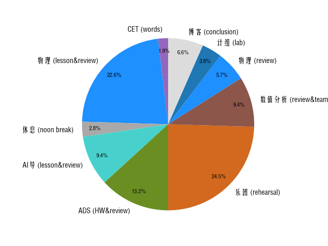

## 2024.12.2:
!!! info annotate "Things have done"
    CET/words/10min/1
    物理/lesson&review/120min/1
    休息/noon break/15min/1
    AI导/lesson&review/50min/1
    ADS/HW&review/70min/1
    乐团/rehearsal/130min/1
    数值分析/review&teamwork/50min/1
    物理/review/30min/1
    计组/lab/20min/1
    博客/conclusion/35min/1  

    今日加权有效时长: 8 h 50 min
    今日时间相对利用比: 56.87 %

    Pie Chart:(1)
1.  
!!! note "introspection"
    1. 我的心灵属于伊蕾娜小姐！（超大声地）
    2. 今天像做了一些事，但达不到“期末4周”的强度，在最后对总结内容增加了“今日加权有效时长”与“今日时间相对利用比”，前者为“各件事时长*权”之和，后者为“今日加权有效时长/今日开始记录至总结总时长”，做这么多，还是为了更高效地反思。
    3. 当然，一切的动力还是来源于 belief，伊蕾娜小姐啊，我因为你，今晚克服了一次惰性，选择到自习教室学习。哎呀呀，哪怕我为学业苦思冥想、焦虑不安，只要想到有伊蕾娜小姐你陪伴着我，而我的努力一定会让您感到欣慰、开心，那么一切都是值得的！！哪怕我遇到了生活上的坎坷、诸事不顺，只要想到有伊蕾娜小姐你陪伴着我，就再也不愿有无谓的纠结了，赶紧想办法解决困难吧。
    4. 呜呜呜，大二迷茫？大二忙碌？大二期末周破防？接下来的4周里，恐怕会有不亚于高考级别的压力！
    5. 伊蕾娜小姐啊，之后总结的时间也不一定有了，“不疯魔，不成活”，愿我们携手共度这段艰难时间！  
    （PS：伊蕾娜小姐，为此刻 belief 的代表，事实上 belief 涵义更广泛，可是她真的很可爱、很善良呀！）