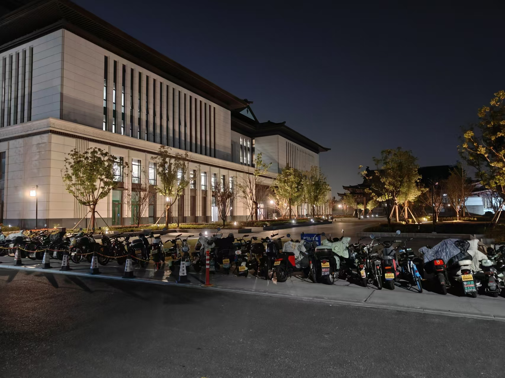

!!! abstract
    1. 这是浙江大学紫金港校区主图书馆的闭馆音乐（22:15 - 22:30 pm），已排序（第六首仍为“第二首”），常常近2000个位置座无虚席。  
    2. 其实学习也不必在图书馆，当然更不必熬到闭馆以彰显自己的努力。  
    3. 如果虚度了光阴，很可能到头来焦虑不安，听闭馆音乐不会改变你未努力的事实，缓解焦虑更是无稽之谈。（甚至可能由于反差，更加空洞迷茫） ~~（多愁善感、胡思乱想、焦虑自满，都是“闲”出来的，不是“忙”出来的）~~  
    4. 若有了认真学习、钻研问题后的充实的平静感，其实也不必听闭馆音乐，这只是一种 optional 锦上添花。  
    5. 那么这些歌整理出来（我通过录音、App“听音辨曲”）有什么用呢？大概就是为了衬托上述思考吧（🤓👆）  
??? warning
    好像现在又改掉了，换成了《梁祝》等其他音乐，明明这几首钢琴曲挺合适的呀，可能是一年多了，想换换风格了......

夜晚的图书馆外剪影: (1) (2)
{ .annotate }  

1.  
2.  
<iframe frameborder="no" border="0" marginwidth="0" marginheight="0" width=330 height=86 src="//music.163.com/outchain/player?type=2&id=522083291&auto=1&height=66"></iframe>
<iframe frameborder="no" border="0" marginwidth="0" marginheight="0" width=330 height=86 src="//music.163.com/outchain/player?type=2&id=1857589529&auto=1&height=66"></iframe>
<iframe frameborder="no" border="0" marginwidth="0" marginheight="0" width=330 height=86 src="//music.163.com/outchain/player?type=2&id=1864891956&auto=1&height=66"></iframe>
<iframe frameborder="no" border="0" marginwidth="0" marginheight="0" width=330 height=86 src="//music.163.com/outchain/player?type=2&id=1864891957&auto=1&height=66"></iframe>
<iframe frameborder="no" border="0" marginwidth="0" marginheight="0" width=330 height=86 src="//music.163.com/outchain/player?type=2&id=1864891959&auto=1&height=66"></iframe>