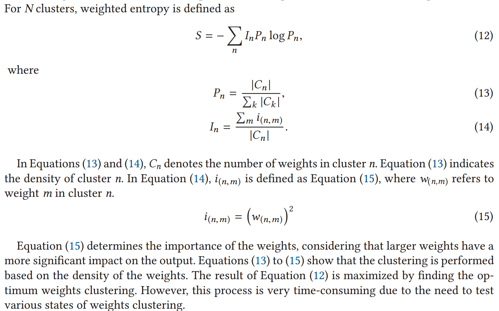
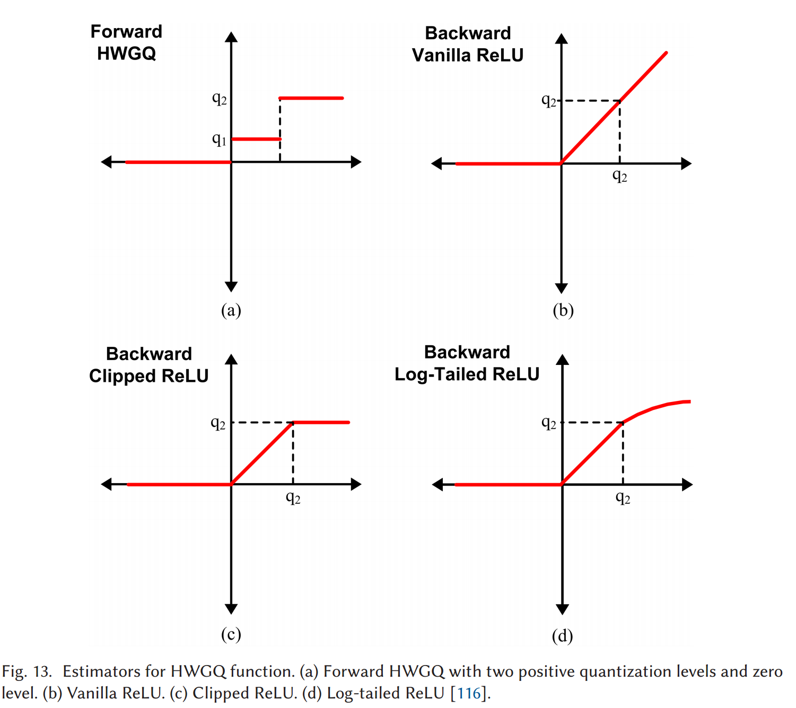

#  
#### Paper: [A Comprehensive Survey on Model Quantization for Deep Neural Networks in Image Classification](https://dl.acm.org/doi/10.1145/3623402){target="_blank"}
!!! abstract
    - 背景：Deep Neural Networks (DNNs) 在机器学习领域取得了重大进步，优点是精度高，缺点是存储消耗高，耗能高，这使得他们在有限的硬件资源上难以使用，量化 （Quantization）（the full-precision values are stored in low bit-width precision）即为解决这一难题的方法之一。
    - Quantization的优点：1. Quantization not only reduces memory requirements but also replaces high-cost operations with low-cost ones. 2. DNN quantization offers flexibility and efficiency in hardware design, making it a widely adopted technique in various methods.
    - 贡献：
        1. Consequently, we present a comprehensive **survey of quantization** concepts and methods, with a focus on image classification. 
        2. We describe **clustering-based quantization** methods and explore **the use of a scale factor** parameter for approximating full-precision values. 
        3. Moreover, we thoroughly review **the training of a quantized DNN**, including the use of a straight-through estimator and quantization regularization. We explain the replacement of floating-point operations with low-cost bitwise operations in a quantized DNN and the sensitivity of different layers in quantization. 
        4. Furthermore, we highlight the evaluation **metrics for quantization methods** and important **benchmarks in the image classification task**. We also present the accuracy of the state-of-the-art methods on CIFAR-10 and ImageNet. 
        5. This article attempts to make the readers familiar with the basic and advanced concepts of quantization, introduce important works in DNN quantization, and highlight challenges for future research in this field.
## 1 简介
1. Deep Convolutional Neural Network (DCNN) 成就斐然，但需要存储大量参数，进行大量计算（The main operation in DCNNs is multiply-accumulate
(MAC) in convolution and Fully Connected (FC) layers.），所以DNNs的加速很有必要。
2. In the beginning, the focus was on hardware optimization for processing speedup in DNN accelerators.  
->  Later, researchers concluded that compression
and software optimization of DNNs can be more effective before touching hardware.
3. The approaches in DNN compression:
    - **Quantization**: approximates the numerical network components with low bit-width precision.
    - **Pruning**: removing unnecessary or less important connections within the network and
    making a sparse network that reduces memory usage as well as computations.
    - **Low-rank approximation**: an approach to simplify matrices and images, creates a
    new matrix close to the weight matrix, which has lower dimensions and fewer computations in DNNs.
    - **Knowledge Distillation (KD)**: employ a simpler model that exhibits generalization and accuracy comparable to the complex model.
    ??? note "Advantages of quantization"
        - High compression, with less accuracy reduction.
        - Flexibility  
        -- Since quantization is not dependent on the network architecture, a quantization algorithm can be
        applied to various types of DNNs. (Many quantization methods originally designed for
        DCNNs are also used for Recurrent Neural Networks (RNNs) and Long Short-Term Memory (LSTM) networks) .
        - Smaller number of cycles on hardware  
        -- as high-cost floating-point operations are replaced with low-cost operations.
        - Reduces the cost of hardware accelerator design.  
        -- For instance, in 1-bit quantization, a 32-bit floating-point multiplier can be replaced an XNOR operator, leading to a
        cost reduction of 200 times in Xilinx FPGA
        - Contribute to controlling
        overfitting.  
        -- By simplifing parameters
4. 列举了一些关于各种Quantization方式的参考文献 (binary,mixed-precision,distillation-assisted,hardware-aware......)
5. 概况后续内容 (同abstract)
## 2 神经网络基本概念
1. A DCNN consists of various types of layers, and the common layers include **convolution layer, normalization layer, pooling layer, and FC layer**.
2. - The main layer in DCNN is the convolution layer, which is formed in three
    dimensions. 
    - This layer produces an output feature map by convolving multiple filters (weights)
    with the input feature map. 
    - There is weight sharing in the convolution layer, which means that
    each weight is applied to different connections. 
    - The majority of computationsin DCNNs are in this
    layer due to its three-dimensional structure and **weight sharing**.
3. **Weight sharing** -> a significant reduction in the number of parameters.  
-> the majority of parameters in DCNNs are typically in the FC layers, where each neuron
is connected to all neurons in both the previous and next layers.
4. As **the convolution and FC layers**
contain the majority of **computations and parameters in DCNNs**, the primary focus is on these
layers in accelerators and compression techniques.
## 3 量化的概念
Quantization is mapping values from a continuous space to a discrete space, where full-precision
values are mapped to new values with lower bit-width called quantization levels.
### 3.1 (网络组成中)量化的对象
- Each numerical component in neural networks can be quantized. ‌These components are typically divided into three main categories: weights, activations, and gradients.
- Weights: the most common (But in
most cases, biases and other parameters, such as batch normalization parameters, are kept in full
precision in view of the fact that they include a minimal rate of neural network parameters, and the
quantization of them is less efficient in compression.)
- Activations: 比weights的量化更困难 (While
weights remain fixed after training, activations change during the inference phase according to the
input data.)，但仅仅对weights量化效率不高、内存使用率低, 故需共同量化
- Gradients: 仅对训练时的加速有用，更难量化(Gradients are propagated
from the output to the first layer of a network during the backward pass of the EBP algorithm.
High-precision gradients are essential for the convergence of the optimization algorithm during
training. Furthermore, due to the wide range of gradient values, accurate quantization requires the
use of more bits.)

### 3.2 何时量化
| | Quantization-Aware Training (QAT)|Post-Training Quantization (PTQ).|
|---|---|---|
|When| During training| After training|
|Defect| In a low bit-width precision quantized network, the convergence of the learning algorithm is challenging. -> requires more iterations than the full-precision network for convergence. It needs customized solutions compatible with a discrete network.| A reduction in model accuracy. -> needs retraining, fine-tuning agter quantization -> repeat to reach an acceptable accuracy.|
|Speedup phase|the training and inference phases|the inference phase|

- The model accuracy in the QAT approach is commonly higher than in PTQ, because the trained
model is more compatible with the quantization process.
### 3.3 确定性(deterministic)和随机(stochastic)量化
#### Deterministitc Quantization Methods
- Binary quantization:

$$b=\text{Sign}\left(x\right)=\begin{cases}+1\quad x\geq0\\-1\quad x<0\end{cases}.$$

- Ternary quantization:

$$t=\begin{cases}+1&x>\Delta\\0&|x|\leq\Delta\\-1&x<-\Delta\end{cases}.$$

- Others:

$$Q\left(x\right)=Sign\left(x\right).d.\min\left(round\left(\frac{\left|x\right|}d\right),\frac{M-1}2\right)$$

d represents the step size, and M is an odd number and determines the number
of quantization levels. Consequently, the quantization levels include zero, positive, and negative
values symmetrically.

$$quantize_k=\frac1{2^k-1}round\left(\left(2^k-1\right)x\right),0\leq x\leq1$$

It maps the full-precision values in the range $x\in[0,1]$ to $2^k$ quantization levels within the same interval with step size $\frac1{2^k-1}.$ For $k$ bit-width, the quantization levels are $L_q=$ $\{0,\frac1{2^k-1},\frac2{2^k-1},\ldots,1\}.$ For example, for $k=2$,there are $2^2=4$ quantization levels, which are $L_q=$ $\{ 0$, 1/3, 2/3, $1\} .$

- Learned Quantization Network (LQ-Nets):

$$Q\left(x,v\right)=v^Te_l\ e_l\in\left\{-1,1\right\}^K,x\in\left(t_l,t_{l+1}\right).$$

x represents full-precision values, $\nu\in\mathbb{R}^{K}$ denotes the learnable floating-point basis vector, and $e_{l}$ is a $k$-bit binary vector from $[-1,-1,\ldots,-1]\mathrm{~to~}[1,1,\ldots,1].$
#### Stochastic Quantization Methods

$$b=\begin{cases}+1\:p=\sigma\:(x)\\-1\:q=1-p\end{cases}.$$

$$\sigma\left(x\right)=clip\left(\frac{x+1}2,0,1\right)=\max\left(0,\min\left(1,\frac{x+1}2\right)\right).$$

$$\begin{cases}\mathrm{if~}w>0:p\left(t=1\right)=w;\quad p\left(t=0\right)=1-w\\\mathrm{if~}w<0:p\left(t=-1\right)=-w;p\left(t=0\right)=1+w\end{cases}.$$

#### Deterministic and Stochastic Quantization Comparison.
- Stochastic quantization has
shown **better model generalization** compared to deterministic quantization.
- Implementation of stochastic quantization is **more challenging and costly** than deterministic quantization, particularly in hardware implementations, as it
requires a random bit generator.

### 3.4 由分布看量化方法的水平
#### 3.4.1 Uniform and Non-uniform Quantization
- In non-uniform quantization, the step size is determined according to the distribution of the full-precision values, which
makes it more complex and accurate than uniform quantization.
<figure markdown="span">
  </figure>

??? note "base-2 logarithm quantization: (x represents full-precision values)"
    $$Q\left(x\right)=\mathrm{Sign}\left(x\right)2^{round\left(\log_2\left|x\right|\right)}$$

    -> Logarithmic quantization allows the encoding of a larger range of numbers using the same storage in comparison with uniform quantization
    by storing a small integer exponent instead of a floating-point number.

    - Previous studies have revealed that weights in DCNNs often follow a normal distribution with
    a mean of zero:
    <figure markdown="span">
    </figure>
    -> In logarithmic quantization, the quantization levels are denser for
    values close to zero. Therefore, the distribution of quantization levelsin logarithmic quantization is
    matched to the distribution of the full-precision weights in DCNNs, which leads to more accurate
    quantization.

    - The base-2 logarithm quantization is naturally a representation of the binary system.
    -> it is well-matched to digital hardware and provides simple operations. 
#### 3.4.2 Clustering-based Quantization.
<figure markdown="span">
  </figure>

- DeepCompression method:  
using the k-means algorithm, where the weight values in a cluster are close to each other and mapped to the same quantization
level, which is the cluster center.
- Single Level Quantization (SLQ) (for high bit-width precision ):  
the weights of each layer are
clustered separately using the k-means algorithm.  
-> the clusters are grouped into
two categories based on quantization loss.  
-> Low loss: quantization  ; High loss: retrain  
-> These steps are repeated until all the weights are
quantized.  
-> SLQ is not suitable for low bit-width quantization due to the small number of clusters, which leads to significant quantization loss.
- Multiple Level Quantization (MLQ) (for 2-bit and 3-bit quantization.):  
-> (Compared to SLQ) partitions weights not only in the width but **also in the depth** of the network. Layers are quantized iteratively
and incrementally (not at the same time).
- Extended Single Level Quantization (ESLQ):  
changes cluster
centers as quantization levels to values with a specific type. For example, quantization levels are
mapped to the closest number in the form of Power Of Two (POT), making it well-suited for
implementation on FPGA platforms.
??? note "Weighted entropy measure (for evaluating the quality of clustering)" 
    <figure markdown="span">
    </figure>

??? note "Challenges of the clustering-based approach"
    1. Not suitable for implementation
    in hardware and software due to their significant time complexity and computational requirements
    for codebook reconstruction.  
    2. The weights within a
    cluster are not contiguous in memory, which leads to irregular memory accesses with long delays.  
    3. The clustering-based approach is not suitable for activations quantization. (As weights are fixed during training, but activations are not)
#### 3.4.3 Scale Factor.  (未总结)
- 讲了 Ternary Weight Network (TWN) method, Accurate Binary Convolutional
(ABC) method, Trained Ternary Quantization (TTQ), Explicit Loss-error-aware Quantization (ELQ) method......
- The effect of scale factor model on convergence & Challenges of using scale factor

## 4 量化神经网络的训练
??? note "一个神经网络常用的训练方式--EBP (使用梯度下降、链式法则来调整网络参数)"
    <figure markdown="span">
    </figure>
    The weights between layers $k$ and $j$ are updated as  

    $$w_{kj}\left(n\right)=w_{kj}\left(n-1\right)-\gamma\Delta w_{kj},\:\Delta w_{kj}=\frac{\partial E}{\partial w_{kj}}=\sum_{i\in I_{j}}\left(\delta_{i}w_{ji}\right)h'\left(x_{i}\right)y_{k}=\delta_{j}y_{k}.$$

    In the Equation, $w_{kj}(n-1)$ and $w_{kj}(n)$ indicate the weights between $k$ and $j$ layers before and after the update, respectively. $\gamma$ and $\delta$ are the learning rate and the error signal, respectively. $x_i$ and $\gamma_i$ are the inputs and outputs of layer $i$, respectively, and $h^\prime$ denotes the derivative of the activation function.  
- 然而使用该方法需要“连续、精确、不含驻点与不可微分点”的函数，而这在量化神经网络中往往不满足。  
为了解决这个问题，常使用STE方法来估计不可微函数的梯度。

### 4.1 Straight-through Estimator
#### 4.1.1 STE for the $Sign$ function

<figure markdown="span">
</figure>  

Examples:  
- Bitwise Neural Networks -- (a)  
- XNOR-Net and Binarized Neural   Networks (BNN) -- (b) -- hard tanh (Clip)  
- Bi-RealNet -- (c&d)  

(The authors of the Bi-RealNet
paper concluded that higher-order functions require more complex computations, and thus, the
second-order function is acceptable)

#### 4.1.2 Error Decay Estimator (EDE)
Information Retention Network (IR-Net) method  

$$F\left(x\right)=k\tanh\left(tx\right),$$

where $k$ and $t$ are computed as

$$t=T_{min}10^{\frac{i}{N}\times log\frac{Tmax}{T_{min}}},\:k=\max\left(\frac{1}{t},1\right).$$

In the Equation, $i$ determines the epoch number in $N$ epochs, $T_{min}$ is set to $10^{-1}$,and $T_{max}$ is set to 10.EDE lies between the identity function $(y=x)$ and the $hard \  tanh$ function. $Hard \  tanh$ is close to the $Sign$ function, but it discards the parameters outside the range [-1,1].  
??? note
    Consequently, those parameters are not updated anymore, leading to a loss of information. However, the identity function covers the parameters outside [-1,1] but has a significant difference from the $Sign$ function, as indicated by the shaded area in Figure 12. EDE makes a tradeoff between the identity and hard tanh functions by varying parameters $k$ and $t$ during training. Initially, $k$ is bigger than 1,making EDE closer to the identity function. As the number of epochs increases, $k$ gradually tends towards 1, causing EDE transition to hard tanh for achieving more accurate estimation.
    <figure markdown="span">
    {width='800'}</figure>  
#### 4.1.3 Quantized ReLU and STE
<figure markdown="span">
</figure>  

??? note "Log-tailed ReLU function"
    $$\tilde{Q}=\begin{cases}q_m+\log\left(x-\tau\right)\:x>q_m\\x&0<x\leq q_m\:,\quad\tau=q_{m-1}\\0&x\leq0\end{cases}$$
- The derivative of **Half-Wave Gaussian Quantization (HWGQ)** is zero.
- HWGQ is bounded to
qm for x>0, whereas **Vanilla ReLU** tends to infinity. Consequently, using Vanilla ReLU in the
backward pass leads to inaccurate gradients and unstable learning during training.
- In **Clipped ReLU**,
the weak point of the Vanilla ReLU is modified by setting the gradient to zero for x≥qm. The idea behind this modification
comes from the fact that the frequency of the large values is commonly low, and these values are
interpreted as outliers.
- Experimental results in the HWGQ method  show that **Log-tailed ReLU**
achieves higher accuracy in AlexNet compared to Clipped ReLU. However, **Clipped ReLU** achieves
superior performance compared to Log-tailed ReLU in VGGNet-variant and ResNet-18, which are
deeper than AlexNet.  
#### 4.1.4 Bounded rectifier and STE
??? note
    In the ABC method , a bounded rectifier activation function
    was proposed for mapping the full-precision activations to the range [0,1] as

    $$h_v\left(x\right)=clip\left(x+v,0,1\right)=\begin{cases}1&x+v>1\\x+v&0<x+v<1\\0&x+v<0\end{cases}.$$

    In Equation represents a trainable shift parameter. After mapping the values to the range  
    [0,1],Equation is utilized for binarization as

    $$A=H_\upsilon\left(R\right)=2\mathbb{I}_{h_\upsilon\left(R\right)\geq0.5}-1=\begin{cases}+1\:h_\upsilon\geq0.5\\-1\:h_\upsilon<0.5\end{cases}.$$

    In Equation, l indicates the Indicator function. In the backward pass, STE is applied, and the
    gradient is computed as

    $$\frac{\partial c}{\partial R}=\frac{\partial c}{\partial A}\mathbb{I}_{0\leq R-v\leq1}.$$

#### 4.1.5 Parametric quantization function and STE
??? note
    $$y=PACT\left(x\right)=0.5\left(\left|x\right|-\left|x-\alpha\right|+\alpha\right)=\begin{cases}0\:x\in\left(-\infty,0\right)\\x\:x\in\left[0,\alpha\right)\\a\:x\in\left[\alpha,+\infty\right)\end{cases}.$$

    (45)

    The PACT function maps the full-precision activations to the range [0, $\alpha].$ Then the output of
    the PACT function is quantized to $k$ bit-width precision using Equation (46).

    $$y_q=round\left(y\frac{2^k-1}\alpha\right)\frac\alpha{2^k-1}$$

    (46)

    If $\alpha$ is equal to 1,then the PACT function corresponds to the bounded rectifier function with $\upsilon=0$ in the ABC method [117]. The optimum $\alpha$ is found during training for minimizing the accuracy drop in quantization. It should be noted that the optimum value varies across different layers and models. Since Equation (46) is not differentiable, STE is employed for updating $\alpha:$

    $$\frac{\partial y_q}{\partial\alpha}=\frac{\partial y_q}{\partial y}\frac{\partial y}{\partial\alpha}=\begin{cases}0&x\in(-\infty,\alpha)\\1&x\in[\alpha,+\infty)\end{cases}.$$

    (47)

    The training is dependent on the value of $\alpha.$If the initial value of $\alpha$ is too small, then, according to Equation (47), most activations will fall in the range of non-zero gradient, causing frequent changes in the value of $\alpha$ during training and leading to low model accuracy. However, if the initial value of $\alpha$ is too large, then the gradient will be zero for the majority of activations, leading to small gradients and the risk of gradient vanishing in the EBP algorithm. To address this, $\alpha$ is initialized with a large value that is not excessively large and then reduced using L2-norm regularization.
    Although the effectiveness of STE has been demonstrated in practice through the results of previous works, there is still a concern regarding the lack of theoretical proof for its performance. Therefore, in recent years, some researchers have made efforts to theoretically justify the performance of STE [138, 139] . 
    Table 3 summarizes the forward quantization function and its estimator in the backward pass
    using STE for several previous works.
### 4.2 权值更新
<figure markdown="span">
</figure>  

- 为防止无效update，常常在update weights**过程中**使用full-precision.
### 4.3 训练参数
- In quantized networks, a smalel learning rate often yields better.
#### 4.3.2 Network Structure:
- Sometimes structural adjustments are necessary for the neural network after quantization.
??? example "example"
    For instance, the max-pooling layer in some binary DNNs is displaced. In
    DCNNs, a max-pooling layer commonly comes immediately after the activation layer. However,
    in a binary neural network, where the Sign function is used for the binarization of the activations,
    placing the max-pooling layer immediately after the Sign function results in an output matrix containing only +1 elements, as the values in a binarized matrix are −1 and +1. This leads to a loss
    of information.
#### 4.3.3 Regelarization:
- In quantization, approximating weights with low bit-width precision acts as a regularizer, and pushing the weights toward zeros can lead to a significant drop
in accuracy.  
??? note "some approaches"
    - Bit-level Sparsity Quantization (BSQ) suggested a regularization for mixed-precision quantization.  
    - a periodic regularization to push the full-precision weights toward the quantization levels.  
    - Tang et al. introduced a new regularization for binary quantization:

    $$
    J\left(W,b\right)=L\left(W,b\right)+\lambda\sum_{l=1}^L\sum_{i=1}^{N_l}\sum_{j=1}^{M_l}\left(1-\left(W_{l,ij}\right)^2\right)\\J\left(W,b\right)=L\left(W,b\right)+\lambda\sum_{l=1}^L\sum_{i=1}^{N_l}\sum_{j=1}^{M_l}\left(1-\left(W_{l,ij}\right)^2\right)$$

    In Equation, $L(W,b)$ represents the loss function, and the second term denotes the regularization relation. $L$ indicates the number of layers. $N_l$ and $M_l$ are the dimensions of the weight matrix in layer $\iota$ The parameter $\lambda$ controls the effect of the loss function and regularization term.
    <figure markdown="span">
    - 
    </figure>
    <figure markdown="span">
    </figure>
## 5 量化网络中的操作
> 讨论了在深度卷积神经网络（DCNNs）中实现乘累加（MAC）操作的效率问题。MAC操作是DCNNs中的主要计算任务，通常涉及大量的浮点数乘法和加法。量化技术通过将32位浮点数映射到更低比特宽度（如8位、4位、2位和1位）的值，从而在硬件平台上用更高效的整数或位操作替换高成本的浮点操作。  

- 量化操作：介绍了几种量化方法，包括对数量化和POT（Power Of Two）量化，这些方法通过位移动操作来替代浮点乘法，从而提高计算效率。  
- 位操作：讨论了如何在二进制神经网络中使用位操作（如XNOR和AND）来执行MAC操作，这在硬件实现中非常有效率。  
- 零水平量化：探讨了在量化中定义零水平可以减少计算量，因为乘以零的操作可以被省略。  
## 6 量化网络中的层
> 分析了在DCNNs中量化不同层对预测准确性的影响。网络中的每层对量化的敏感性不同，这取决于层的结构和在网络中的位置。

- 第一层和最后一层：讨论了量化输入层和输出层对模型准确性的影响，这些层对量化特别敏感，因为它们直接关系到网络的输入和输出。  
- 混合精度量化：介绍了根据网络层的敏感性为每层分配不同比特宽度的方法。这种方法旨在在准确性和压缩率之间找到最佳权衡。  
- 层的重要性：讨论了如何评估每层在量化中的重要性，以及如何根据这些信息来决定每层的量化精度。  
## 7 评估与讨论
（含大量数据、表格，讨论对比了各神经网络在不同数据集上的表现）
## 8 总结与展望
??? abstract
    - In this article, we surveyed the previous quantization works in the image classification task. The
    basic and advanced concepts of DCNN quantization were discussed, as well as the most important
    methods and approaches in this field, along with their advantages and challenges. Some previous
    works perform quantization on both weights and activations, offering a higher compression rate
    and employing lower-cost operations compared to approaches that are quantized only weights.
    However, quantization of activations is more challenging compared to weights, which is due to
    the wide range of activations, the use of a non-differentiable activation function, the estimation
    of activations during the backward pass, and the variation of activation values during inference.  
    - The QAT and PTQ methods were studied, and it is concluded that the QAT methods generally achieve higher accuracy than the PTQ methods in the inference phase. Training a quantized
    DNN poses new challenges compared to a full-precision network since the units are discrete. Itcommonly requires additional iterations for convergence in contrast to training a full-precision
    network, and adaptive training strategies are required to build an accurate model. For instance,
    the adjustment of learning rate and regularization techniques can be different from the training in
    the full-precision network.  
    - We discussed uniform and non-uniform quantization techniques and concluded that nonuniform quantization, especially the POT quantization approach, efficiently covers the distribution of full-precision values, which leads to enhanced accuracy. For decreasing quantization error,
    it is important to allocate quantization levels to informative regions. Using the scale factor helps
    in shifting the quantization levels to the most informative parts of data.  
    - Some previous methods have successfully achieved high accuracy on large-scale datasets, such
    as ImageNet, when both weights and activations are quantized in low bit-width. However, quantization with a precision lower than 4 bits remains a challenging task, especially in deeper networks.
    During the training of a quantized network, STE is commonly used for calculating gradients in the
    backward pass. The noise resulting from gradient mismatch, due to inaccurate estimation, is amplified layer-by-layer from the end of the network to the initial layers. This amplification of noise
    is more considerable in deeper networks compared to shallow networks. In the training, this noise
    can have a negative impact on model convergence. Additionally, since the number of parameters
    increases with the depth of the neural network, the range of parameters in the deeper networks is
    wider than in shallow ones, and the quantization is more challenging. Accordingly, future works
    should focus on addressing the quantization of weights and activations in deeper networks with
    low bit-width, such as binary or ternary quantization.  
    - In this article, we discussed mixed-precision, which is currently an interesting approach in the
    quantization of the DNNs. The main challenge in mixed-precision quantization is the exponential time complexity in finding the optimum bit-width for each layer. It is desirable for future
    worksto develop solutionsthat can determine the optimum mixed-precision with polynomial time
    complexity.
