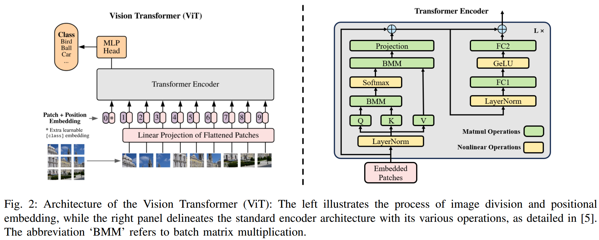

#
#### Paper: [Model Quantization and Hardware Acceleration for Vision Transformers: A Comprehensive Survey](https://arxiv.org/abs/2405.00314){target="_blank"}
!!! abstract
    - 背景：Vision Transformers (ViTs) 在许多视觉领域正替代convolutional neural networks (CNNs) ，但ViTs的模型大、算力、存储需求大，尤其是对于资源受限的设备，这突出了 algorithm-hardware co-design 的重要性。而量化模型（算法）便可很好地提高其效率。
    - 贡献（survey）：  
        1. 一些独特的 ViTs 架构的特性与运行时间。  
        2. 模型量化的基本原理，对最先进的 ViTs 量化技术进行了比较分析。
        3. 量化 ViTs 的硬件加速，突出了 hardware-friendly algorithm 设计的重要性。
        4. 当前挑战与未来研究展望
## 1 简介
背景 + 目前部分 survey 的问题（忽略 hardware 或 algorithm，主要用于大语言模型的压缩） + 本文结构（目录）
## 2 ViTs 架构及性能分析
The Vision Transformers (ViTs), utilizing the self-attention mechanism to grasp “long-range” relationships in
image sequences, 在 CV 领域取得了重大成功.  
### 2.1 ViTs 架构概述
<figure markdown="span">
  </figure>  

??? note "details"  
    - The process culminates with a fully-connected layer, termed
    the “MLP Head”, for classification purposes.  

    - The MHA (Multi-Head Attention) module first projects the image sequence by multiplying it through distinct weight matrices $W^Q,W^K$ and $W^V$, generating query $(Q)$, key $(K)$,and value $(V)$ activation. The self-attention mechanism is then applied as follows:

    $$\mathrm{Attention}(Q,K,V)=\mathrm{softmax}\left(\frac{QK^T}{\sqrt{d_k}}\right)V,$$

      where $d_k$ represents the dimensionality of the key vectors. The MHA aggregates information from multiple representation subspaces, synthesizing the outputs from different heads into a unified representation:

    $$\text{MultiHead}(Q,K,V)=\text{Concat}(\text{head}_1,\ldots,\text{head}_h)W^O,\quad$$

      with each head defined as:

    $$\mathrm{head}_i=\mathrm{Attention}(QW_i^Q,KW_i^K,VW_i^V).$$

    - The FFN (Feed-Forward) module, which includes two dense layers activated by GELU , processes each token individually, augmenting the model's capacity to understand intricate functions:

    $$\mathrm{FFN}(x)=GELU(xW_1+b_1)W_2+b_2.$$

    - In summary, the MHA encompasses six linear operations, including four weight-to-activation transformations ($W^Q,W^K,W^V$, and $W^O$) projections and two activationto-activation transformations $Q\times K^T$ and Out$_\mathrm{softmax}\times V.$ In contrast, the FFN comprises two linear projections $W_1$ and $W_2$. Non-linear operations like Softmax, LayerNorm, and GELU, though less prevalent, present computational challenges on conventional hardware due to their complexity, potentially restricting the enhancement of end-to-end transformer inference.

