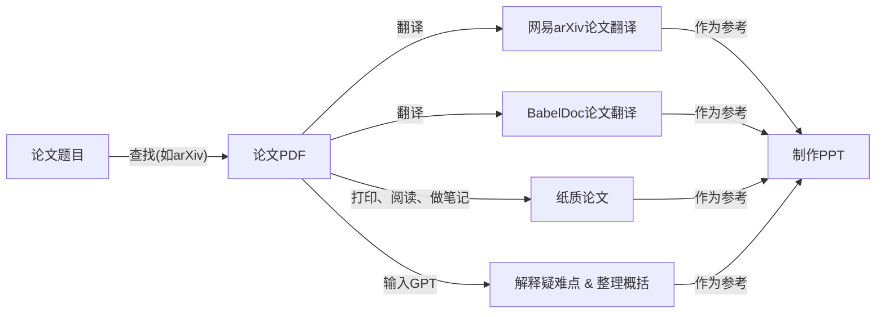

## 组会分享所读论文
!!! abstract
    - Input: 提前一段时间（如“一周”），导师告知的论文题目
    - Output: 一个论文介绍PPT，能够进行presentation、与导师交流内容（视频上传至BiliBili）

```mermaid
graph LR
    A[论文题目] -- 查找(如arXiv) --> B[论文PDF]
    B -- 翻译 --> C[网易arXiv论文翻译]
    B -- 翻译 --> C2[BabelDoc论文翻译]
    B -- 打印、阅读、做笔记 --> D[纸质论文]
    B -- 输入GPT --> E[解释疑难点 & 整理概括]
    C -- 作为参考 --> F[制作PPT]
    C2 -- 作为参考 --> F[制作PPT]
    D -- 作为参考 --> F[制作PPT]
    E -- 作为参考 --> F[制作PPT]

    click C "https://fanyi.youdao.com/trans/#/home" _blank
    click C2 "https://app.immersivetranslate.com/babel-doc/" _blank
```