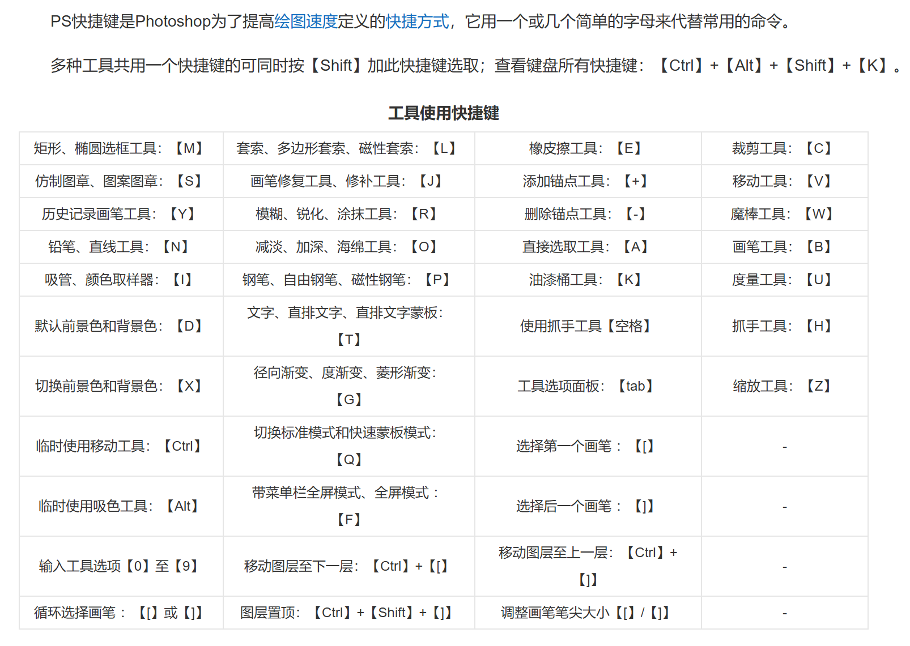
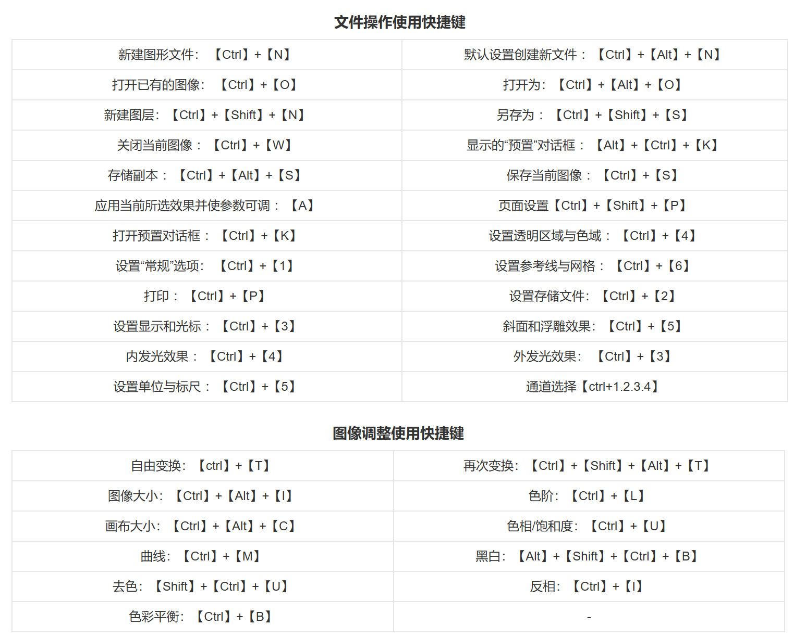
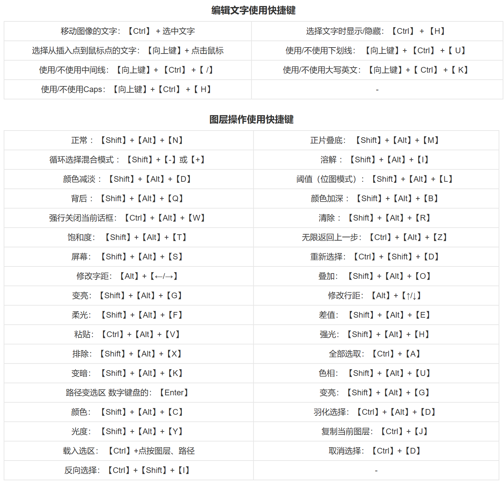

# PS 快捷键

??? "自己以前总结的"
    |Command|Meaning|Command|Meaning|
    |---|---|---|---|
    |Ctrl + J|拷贝|Ctrl + T|缩放、移动图片/文字[+Shift -> 变扁]|
    |Alt + 滚轮|缩放屏幕|Ctrl + "+/\-"|缩放屏幕|
    |z(English) + 左/右划|缩放屏幕|Ctrl + Alt|改变点的位置|
    |Ctrl + K|打开首选项|Ctrl + E|合并图层|
    |Alt + delete|改变"填充色"|Ctrl + D|取消"选框"|
    |Ctrl + D|调出"标尺"|Ctrl|选图形/锚点（可"拉框"/"点击"）|
    |Ctrl + Shift|"调出选框"|Ctrl + Shift + I|"反选"|
    |Ctrl + A|全选|
- 以下复制自百度百科

