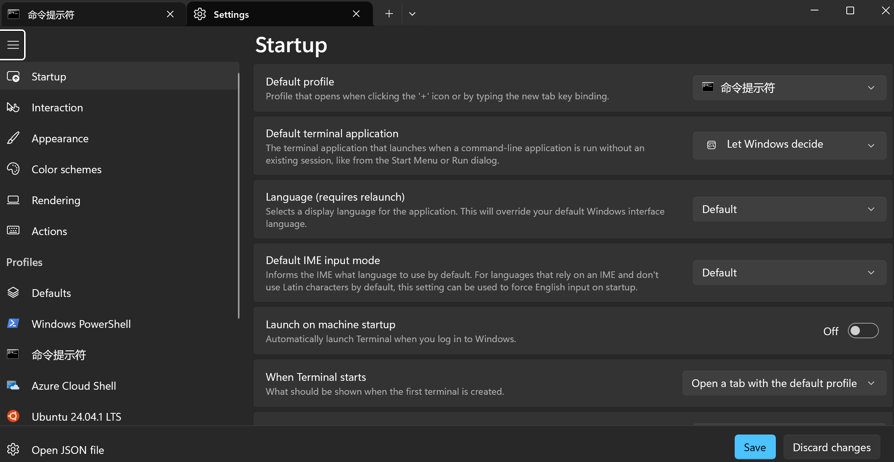
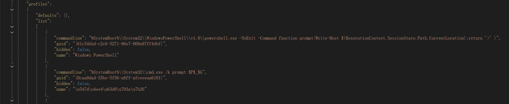

??? abstract
    - 为了严谨描述一个项目，项目的每一级文件夹可能都有较长的英文名。
    - 当我们处于较深的目录时，在Terminal中输入命令时，我们输入的命令往往会在“路径”之右。如：
    ``` title="terminal"
    D:\xxxxxxxxxxxx\x\x\xxxx\xxxxx\x\xxxx>cd xxxxxx
    D:\xxxxxxxxxxxx\x\x\xxxx\xxxxx\x\xxxx\xxxxxx>python setup.py install
    D:\xxxxxxxxxxxx\x\x\xxxx\xxxxx\x\xxxx\xxxxxx>cd ..\xxx
    D:\xxxxxxxxxxxx\x\x\xxxx\xxxxx\x\xxxx\xxx>python xxx.py
    ```
    - 显然这并不利于我们“优雅地”查看命令。
    - 所以笔者在这里介绍一种快捷的方式（也有很多其他方式，STFW），使"命令"显示在"路径"下一行：
    ``` title="terminal"
    D:\xxxxxxxxxxxx\x\x\xxxx\xxxxx\x\xxxx
    >cd xxxxxx
    D:\xxxxxxxxxxxx\x\x\xxxx\xxxxx\x\xxxx\xxxxxx
    >python setup.py install
    D:\xxxxxxxxxxxx\x\x\xxxx\xxxxx\x\xxxx\xxxxxx
    >cd ..\xxx
    D:\xxxxxxxxxxxx\x\x\xxxx\xxxxx\x\xxxx\xxx
    >python xxx.py
    ```
    - 配合PowerShell的“命令高亮”使用更佳

(PS: 面向 Windows)

1. 首先进入Terminal，用`Ctrl+,`打开设置:

<br><br>

2. 点击左下角的`Open JSON file`，在打开的文件中 ~~(强烈建议在改动前先复制、保留，以便可能的复原)~~ 找到 -> profiles -> list  
在对应commandline处添加为以下代码
```json
"commandline": "%SystemRoot%\\System32\\WindowsPowerShell\\v1.0\\powershell.exe -NoExit -Command function prompt{Write-Host $($executionContext.SessionState.Path.CurrentLocation);return '>' }",
"commandline": "%SystemRoot%\\System32\\cmd.exe /k prompt $P$_$G"
```

<br><br>

3. 保存，退出，打开一个新的Terminal，即可看到命令和路径的分离。

??? note "可选，VSCode 中Terminal的类似设置"
    ```json
    "terminal.integrated.profiles.windows": {

            "PowerShell": {
                "source": "PowerShell",
                "icon": "terminal-powershell",
                "args": [
                    "-NoExit",
                    "-Command",
                    "function prompt{Write-Host $($executionContext.SessionState.Path.CurrentLocation) ;return '>'}"
                ]
            },
            "Command Prompt": {
                "path": [
                    "${env:windir}\\Sysnative\\cmd.exe",
                    "${env:windir}\\System32\\cmd.exe"
                ],
                "args": ["/k", "prompt $P$_$G"],
                "icon": "terminal-cmd"
            },
    }
    ```

<br><br><br><br>