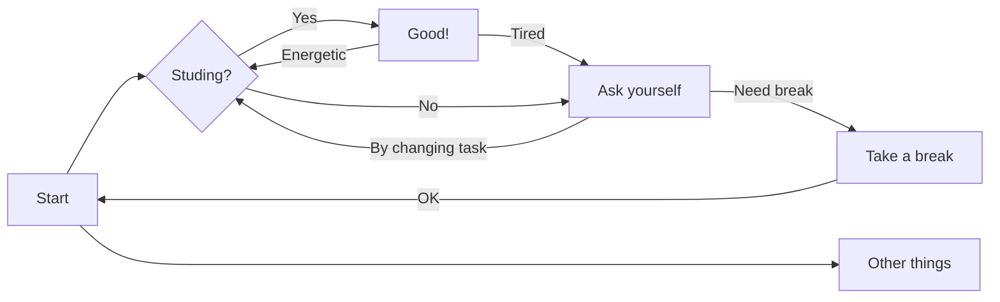

# **Welcome to xueba's notebook!**

```mermaid
graph LR
  A[Start] --> B{Studing?};
  B -->|Yes| C[Good!];
  C -->|Energetic| B;
  C -->|Tired| D[Ask yourself];
  D -->|By changing task| B;
  B -->|No| D;
  D -->|Need break| E[Take a break];
  E -->|OK| A;
  A ----->F[Other things];
```